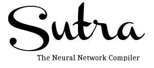

# README #

SutraC is compiler for TNNL language. The TNNL(pronounced as TuNNeL) stands for The Neural Network Language. This repository has compiler for the TNNL language 

  

### Requirements ###

*  LLVM 6.0 (Build scripts included in project)
*  Linux 64 bit, preferable CentOS 7 64 bit.
*  AMD64 ABI. Can be found [here](https://software.intel.com/sites/default/files/article/402129/mpx-linux64-abi.pdf).
*  C++ 14 enabled compiler (>= g++ 4.8.5).
*  LLVM requires CMake 3.4.3 to build
*  For more info look at [LLVM DOCS](https://llvm.org/docs/GettingStarted.html).


### How to get started? ###

* Setup & Install LLVM 6.0.
* Also setup clang , compiler-rt , dragonegg, libcxx, libcxxabi, libunwind, lld, lldb,openmp & polly.
* LLVM Tutorial for making languages, which can be found [here](https://llvm.org/docs/tutorial/)


### Language Specification for TNNL ###

* TNNL Language design.
* TNNL Grammar design.
* TNNL Optimizations.
* For detailed information, check docs in repositorty.

### Build SutraC, LLVM and other projects as follows ###

* In case of RedHat based system (Cent OS 7 etc )do following


		```sudo yum-builddep -y llvm clang```


* In case of Debain based systems( Ubuntu , mint etc) do following


		```sudo apt-get build-dep llvm   
   			sudo apt-get build-dep clang```
			   


```
		$ git clone --recursive https://chakraoverflow@bitbucket.org/tnnc/sutrac.git
		$ cd sutrac
		$ cd llvm-build-scripts
		$ sh build.sh
		$ cd ..
		$ mkdir build && cd build  
		$ cmake ..  -DCMAKE_INSTALL_PREFIX:PATH=../_install
		$ make  
		$ make install  
 
```

### Internal Testing ###

* For purpose of internal testing the install directory is sutrac/_install/.
* The unit testing framework used is catch2. Can be found [here](https://github.com/catchorg/Catch2) .
* Make the test cases with caution, always make all them in sutrac/test directory.
* Also label the test by creating a subdirectory in sutrac/test directory with the name of the test.
* Always use loose coupling in test, explained [here](https://bulldogjob.com/articles/971-on-dependency-injection-loose-coupling-and-unit-tests-in-c).

### Build Status ###

* The build status can be one of ```abandoned``` , ```passing``` and ```release```
* Look at example in reports directory.
* All build reports should be in sutrac/report directory.

### Usage ###
```
$ sutrac <source-file> -o <output-executable>
```  

### Contribution guidelines ###

* Code should be compliant with C++14 standard.
* For unit testing prefer catch2 framework. 
* The code with third-party libraries other than Catch2 and LLVM libraries is not accepeted.

### Submitting Bugs ###

* Create a seperate issue for each of the bugs.
